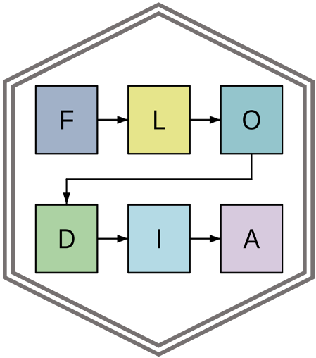

# flodia 
<!-- badges: start -->
[](https://www.repostatus.org/#concept)
[](https://github.com/mrc-ide/flodia/actions)
[](https://codecov.io/gh/mrc-ide/gonovax)
[](https://www.codefactor.io/repository/github/mrc-ide/flodia)
<!-- badges: end -->

`flodia` provides tools for drawing compartmental model flow diagrams in base R.

## Installation

The package can be installed directly from GitHub with:

```r
remotes::install_github("mrc-ide/flodia", upgrade = FALSE)
```

## License

MIT © Imperial College of Science, Technology and Medicine
