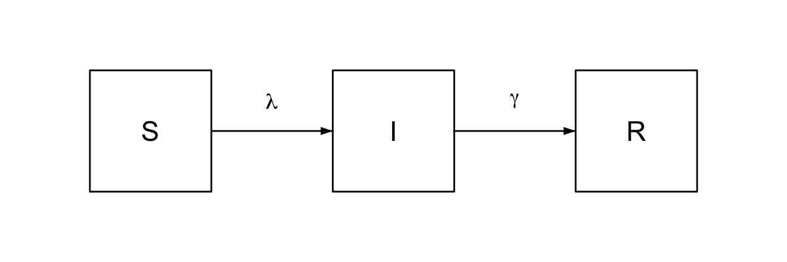
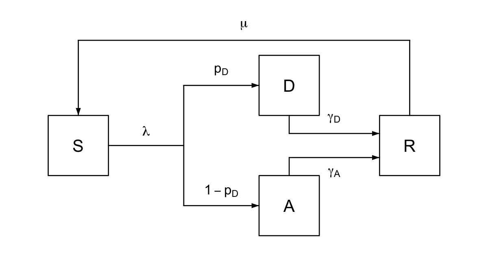
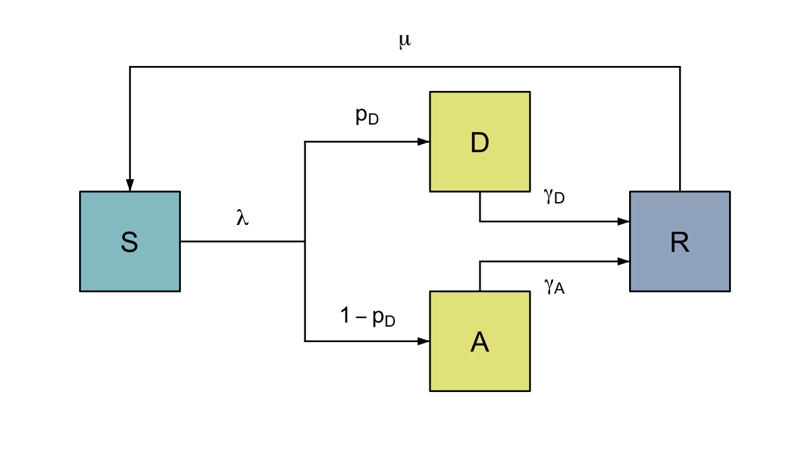

```{r setup, include = FALSE}
knitr::opts_chunk$set(
  collapse = TRUE,
  comment = "#>"
)
```

## Background

`flodia` provides a framework for drawing flow diagrams in base R, aimed at anyone who is tired of messing about in powerpoint, but can't quite bring themselves to learn tikz.

The basic units of a `flodia` are nodes, which can be connected in a variety of ways via flows. Complex diagrams can be built by creating and grouping sub-diagrams. Here I provide a tutorial on how to use the package's main functions to simply create flow diagrams that are clear and easy to adapt.

`flodia` functions on a grid system, with nodes placed based on their (x, y) co-ordinates, and flows proceeding in either the x- or y- direction (i.e. no curves or diagonal lines).

## Getting started

A `flodia` takes the format of a function in which nodes are positioned on the (x, y) grid and connected to each other via flows. The function may take arguments if you like, but it is not necessary. The only real rule is that the function must return a list containing named elements `x0`, `x1`, `y0` and `y1`, which refer to the left-, right-, bottom- and top-most co-ordinates of the `flodia`. All `flodia` objects, either nodes or flows will return a similar list, with additional elements `x` and `y` giving the mid-point of the object.

```{r}
library("flodia")

sir <- function() {
  
  # define the radius of the nodes
  r <- 0.1
  xgap <- 0.3

  # draw the first node at (1, 1)
  S <- node(x = 1, y = 1, r = r, label = "S")
  # draw the second node xgap units to the right of the first
  I <- node(x = S$x1 + xgap, y = S$y, r = r, label = "I")
  # draw the third node xgap units to the right of the second
  R <- node(x = I$x1 + xgap, y = S$y, r = r, label = "R")
  
  # connect the nodes together with flows
  flow(from = S, to = I, label = expression(lambda))
  flow(from = I, to = R, label = expression(gamma))
  
  # return a list of the left, right, bottom and top co-ordinates
  list(x0 = S$x0, x1 = R$x1, y0 = S$y0, y1 = S$y1)
}

flodia_png(sir, filepath = "figs/sir.png", res = 250)

```

{width=15cm}

In addition to simple flows, `flodia` provides functions to connect two or more nodes in a few different ways: namely `bend`, `turn`, `split` and `fork`. Each of these functions comes in an -x or -y variant, depending on the direction of the flow required (e.g. `bendx()` and `bendy()`).

These can be used to create more complex diagrams, for instance, in the above example of an SIR model, we could allow for waning of immunity (by adding a `turn` from R to S), and `fork` the infected compartment (I) into individuals with disease (D) and those who remain asymptomatic (A), and allow them to recover at different rates (by adding a `bend` into R).

```{r}

sdar <- function(col_S = NULL, col_I = NULL, col_R = NULL) {
  
  # define the radius of the nodes
  r <- 0.1
  xgap <- 0.6
  ygap <- 0.2

  # draw S (1, 1)
  S <- node(x = 1, y = 1, r = r, label = "S", node_col = col_S)
  # draw D xgap units to the right, and ygap units above S
  D <- node(x = S$x1 + xgap, y = S$y + ygap, r = r, label = "D",
            node_col = col_I)
  # draw A at the same x-coordinate as d, and ygap units below S
  A <- node(x = D$x, y = S$y - ygap, r = r, label = "A", node_col = col_I)
  # draw R xgap units to the right of A and D
  R <- node(x = D$x1 + xgap / 2, y = S$y, r = r, label = "R", node_col = col_R)
  
  # add flows
  # connect S to A and D
  forkx(from = S, to0 = A, to1 = D, label_from = expression(lambda),
        label_to0 = expression(1 - p[D]),
        label_to1 = expression(p[D])
  )
  # connect D and A to R
  bendy(from = D, to = R, pos_to = 0.7,
        label_to = expression(gamma[D]))
  bendy(from = A, to = R, pos_to = 0.3,
        label_to = expression(gamma[A]),
        label_to_gap = -0.05)
  # connect R to S - record co-ordinates in object rs as this turn extends the
  # top of the flodia (y1)
  rs <- turny(from = R, mid = D$y1 + 0.05, to = S, label_mid = expression(mu))

  
  # return a list of the left, right, bottom and top co-ordinates
  list(x0 = S$x0, x1 = R$x1, y0 = A$y0, y1 = rs$y1)
}

flodia_png(sdar, filepath = "figs/sdar.png", res = 250)

```
{width=15cm}

We can use the optional arguments we gave the function to colour the nodes according to whether they are susceptible to infection, currently infectious, or immune. `flodia` includes two colour palettes `light_palette` and `mid_palette` which assemble colours from the delightful `ghibli` package [via](https://github.com/ewenme/ghibli), but you can specify your own as well.

```{r}

sdar_col <- function() {
  col_S <- light_palette("gnbu")
  col_I <- light_palette("ylgn")
  col_R <- light_palette("bupu")
  sdar(col_S, col_I, col_R)
}

flodia_png(sdar_col, filepath = "figs/sdar_col.png", res = 250)
```

{width=15cm}

Group nodes

```{r}

```


## Styles


## Figures

The figure sizes have been customised so that you can easily put two images side-by-side. 

```{r, fig.show='hold'}
plot(1:10)
plot(10:1)
```

You can enable figure captions by `fig_caption: yes` in YAML:

    output:
      rmarkdown::html_vignette:
        fig_caption: yes

Then you can use the chunk option `fig.cap = "Your figure caption."` in **knitr**.

## More Examples

You can write math expressions, e.g. $Y = X\beta + \epsilon$, footnotes^[A footnote here.], and tables, e.g. using `knitr::kable()`.

```{r, echo=FALSE, results='asis'}
knitr::kable(head(mtcars, 10))
```

Also a quote using `>`:

> "He who gives up [code] safety for [code] speed deserves neither."
([via](https://twitter.com/hadleywickham/status/504368538874703872))
