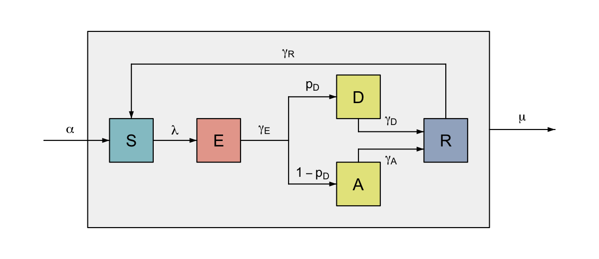
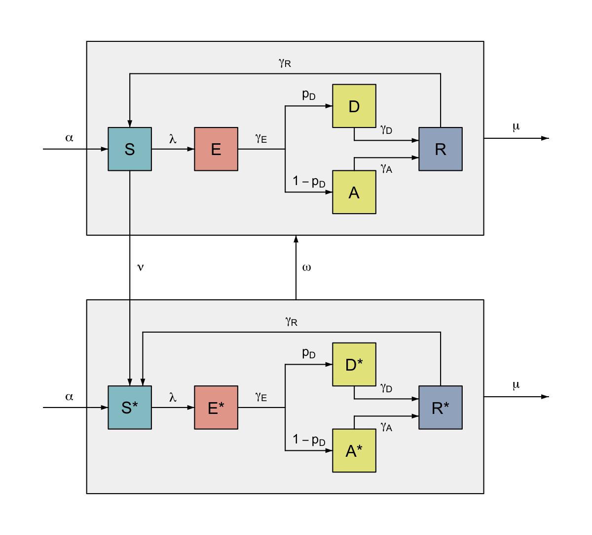

```{r setup, include = FALSE}
knitr::opts_chunk$set(
  collapse = TRUE,
  comment = "#>"
)
```

## Background

`flodia` provides a framework for drawing flow diagrams in base R, aimed at anyone who is tired of messing about in powerpoint, but can't quite bring themselves to learn tikz.

The basic units of a `flodia` are nodes, which can be connected in a variety of ways via flows. Complex diagrams can be built by creating and grouping sub-diagrams. This is a brief tutorial on how to use the package's main functions to quickly create flow diagrams that are clear and easy to adapt.

You can see an example of a `flodia` [here](https://github.com/mrc-ide/sircovid).


## Getting started

A `flodia` takes the format of a function, in which nodes are positioned on the (x, y) grid and connected to each other via flows. Flows proceed in either the x- or y- direction (i.e. no curves or diagonal lines). The function may take arguments if you like, but it is not necessary. The only real rule is that the function must return a list containing named elements `x0`, `x1`, `y0` and `y1`, which refer to the left-, right-, bottom- and top-most co-ordinates of the `flodia`. All `flodia` objects, either nodes or flows will return a similar list, with additional elements `x` and `y` giving the mid-point of the object. Flows additionally return their `from` and `to` nodes, as well as the co-ordinates of any turn points along the length of the flow.

While you can simply place nodes on the grid using their co-ordinates, it is often better to place them relative to each other, taking advantage of their output `x0`, `x1`, `y0` and `y1` co-ordinates. This will generally save you time when tweaking the `flodia`, and is invaluable when grouping together multiple diagrams, as we shall see later.

### Example 1: Simple flow diagram

The following code plots a simple flow diagram for a [Susceptible-Infected-Recovered (SIR)](https://en.wikipedia.org/wiki/Compartmental_models_in_epidemiology) compartmental model. Demonstrating the use of relative node positioning, and the basic `node()` and `flow()` functions.

```{r}
library("flodia")

sir <- function() {
  # define the radius of the nodes
  r <- 0.1
  xgap <- 0.3

  # draw the first node at (1, 1)
  S <- node(x = 1, y = 1, r = r, label = "S")
  # draw the second node xgap units to the right of the first
  I <- node(x = S$x1 + xgap, y = S$y, r = r, label = "I")
  # draw the third node xgap units to the right of the second
  R <- node(x = I$x1 + xgap, y = S$y, r = r, label = "R")

  # connect the nodes together with flows
  flow(from = S, to = I, label = expression(lambda))
  flow(from = I, to = R, label = expression(gamma))

  # return a list of the left, right, bottom and top co-ordinates
  list(x0 = S$x0, x1 = R$x1, y0 = S$y0, y1 = S$y1)
}


```

While you can plot the diagram interactively in the plotting device using the function `flodia()`, it is often better to plot directly to png using `flodia_png()`. This maintains the aspect ratio of the diagram, which is automatically calculated to keep the plotting grid square, and will save you time in the long run.

```{r}
flodia_png(sir, filepath = "figs/example1.png", res = 250)
```


{width=15cm}

### Example 2: Adding more complex flows

In addition to simple flows, `flodia` provides functions to connect two or more nodes in a few different ways: namely `bend`, `turn`, `split` and `fork`. Each of these functions comes in an -x or -y variant, depending on the direction of the flow required (e.g. `bendx()` and `bendy()`).

These can be used to create more complex diagrams, for instance, we can adapt the above SIR model by  allowing an incubation period (E), `fork` the infected compartment (I) into individuals with disease (D) and those who remain asymptomatic (A), allow them to recover at different rates (by adding a `bend` into R), and incorporate waning of immunity (by adding a `turn` from R to S).

We can also colour the nodes according to whether they are susceptible to infection, currently infectious (or not), or immune. `flodia` includes two colour palettes `light_palette()` and `mid_palette()` which assemble colours from fantastic [ghibli palette](https://github.com/ewenme/ghibli), but you can specify any colour scheme you like. There are a host of other formatting options, giving control over positioning, style and font which can be explored by reading the help functions for each type of flow.

```{r}

sedar <- function(S_x = 1, S_y = 1,
                 label = list(S = "S", E = "E", D = "D", A = "A", R = "R"),
                 RS_pos = 0.5) {

  # define the radius of the nodes
  r <- 0.1
  xgap <- 0.3
  ygap <- 0.2
  
  # specify colours for the nodes
  col <- list(S = light_palette("gnbu"),
              E = light_palette("rdor"),
              I = light_palette("ylgn"),
              R = light_palette("bupu"))
  

  # draw S at (S_x, S_y)
  S <- node(x = S_x, y = S_y, r = r, label = label$S, node_col = col$S)
  # draw E xgap units to the right of 
  E <- node(x = S$x1 + xgap, y = S$y, r = r, label = label$E, node_col = col$E)
  # draw D 1.5 * xgap units to the right, and ygap units above E
  D <- node(x = E$x1 + xgap * 1.8, y = S$y + ygap, r = r, label = label$D,
            node_col = col$I)
  # draw A at the same x-coordinate as d, and ygap units below E
  A <- node(x = D$x, y = S$y - ygap, r = r, label = label$A, node_col = col$I)
  # draw R xgap units to the right of A and D
  R <- node(x = D$x1 + xgap, y = S$y, r = r, label = label$R, node_col = col$R)
  
  # add flows
  # connect S to E
  flowx(from = S, to = E, label = expression(lambda))
  # connect E to A and D
  forkx(from = E, to0 = A, to1 = D, label_from = expression(gamma[E]),
        label_to0 = expression(1 - p[D]),
        label_to1 = expression(p[D]))
  # connect D to R
  bendy(from = D, to = R, pos_to = 0.7,
        label_to = expression(gamma[D]))
  # connect A to R
  bendy(from = A, to = R, pos_to = 0.3,
        label_to = expression(gamma[A]),
        label_to_gap = -0.05)
  # connect R to S - record co-ordinates in object rs as this turn extends the
  # top of the flodia (y1) so must be output
  rs <- turny(from = R, mid_y = D$y1 + 0.05, to = S,
              label = expression(gamma[R]), pos_to = RS_pos)

  
  # return a list of the left, right, bottom and top co-ordinates
  # additionally return node S co-ordinates
  list(x0 = S$x0, x1 = R$x1, y0 = A$y0, y1 = rs$y1, S = S)
}

flodia_png(sedar, filepath = "figs/example2.png", res = 250)

```
{width=15cm}

### Example 3: Grouping nodes

It is often useful to group nodes together, we can simplify a diagram by using a single flow to represent a process affecting a group of nodes, rather than individual flows from each. Flodia allows for flows into or out of a diagram (i.e. only connected to a node at one end), via an optional `length` argument to `flowx()`, `flowy()`, `forkx()`, `forky()`, `splitx()`, and `splity()`.  

To continue our previous example, we may for instance want to allow for demographic changes in our model of disease transmission. Individuals are born susceptible to infection, but may die in any stage of infection. While we could add flows out of each compartment to represent deaths, this would quickly become messy, so we instead group the nodes together, and add a flow out of the group.

You may have noticed that we included the node "S" in the list returned by the function in Example 2. By outputting a node we are able to flow directly into it, regardless of whether it is part of a group.

```{r}
sedar_group <- function(S_x = 1, S_y = 1,
                 label = list(S = "S", E = "E", D = "D", A = "A", R = "R"),
                 RS_pos = 0.5) {
  
  # group the nodes together
  g <- group(f = sedar, args = list(S_x = S_x, S_y = S_y, label = label,
                                    RS_pos = RS_pos),
             group_col = grey(0.95), oma = c(0.1, 0.1, 0.15, 0.1))
  
  # specify length of inflow and outflow
  l <- 0.3

  # births into S
  births <- flowx(to = g$S, length = l, label = expression(alpha), label_pos = 0.4)
  # deaths out of group
  deaths <- flowx(from = g, length = l, label = expression(mu))

  # return a list of the left, right, bottom and top co-ordinates, and node S
  list(x0 = births$x0, x1 = deaths$x1, y0 = g$y0, y1 = g$y1, S = g$S)
}

flodia_png(sedar_group, filepath = "figs/example3.png", res = 200)
```
{width=15cm}

### Example 4: Combining groups

When we want to produce multiple sub-diagrams it is often easiest to provide arguments representing the differences between the sub-diagrams to a flodia function. You may have noticed that we provided optional arguments to the functions in Examples 2 and 3, which we have not yet used (but will now come in handy), specifying the x and y co-ordinates of the "S" node, as well as the node labels. 

To continue our previous example of a model of infectious disease, we may want to allow for the possibility of vaccination for susceptible (S) individuals in our SEIRS model diagram. If the vaccine does not provide perfect protection, then we need to mirror the infection process in the vaccinated nodes, which means repeating a grouped sub-diagram. Additionally the vaccine may wane after a time, so we need to flow back from the vaccinated to unvaccinated group.

This can be accomplished by calling our previously written function from Example 3, but providing different arguments to represent the mirrored unvaccinated and vaccinated groups. Here we give nodes in the vaccinated group the superscript *, and use the argument governing the co-ordinates of "S" to position the vaccinated group relative to the unvaccinated group. We can then use flows to connect the groups, and nodes within them (as long as we have passed the required nodes out of the grouping functions, as we have made sure to do here).


```{r}
vax <- function() {
  labels_U <- c(S = "S", E = "E", D = "D", A = "A", R = "R")
  labels_V <- sprintf("%s*", labels_U)
  names(labels_V) <- labels_U

  U <- sedar_group(label = as.list(labels_U))
  V <- sedar_group(S_y = U$y0 - 0.8, label = as.list(labels_V), RS_pos = 0.8)
  
  # add vaccination flow - aligning label between U and V
  flowy(from = U$S, to = V$S, pos = 0.5, label = expression(nu),
        label_y = calc_pos(U$y0, V$y1))
  # add waning flow
  flowy(from = V, to = U, label = expression(omega))

  # return a list of the left, right, bottom and top co-ordinates
  list(x0 = U$x0, x1 = U$x1, y0 = V$y0, y1 = U$y1)
}

flodia_png(f = vax, filepath = "figs/example4.png", res = 200)
```
{width=15cm}
